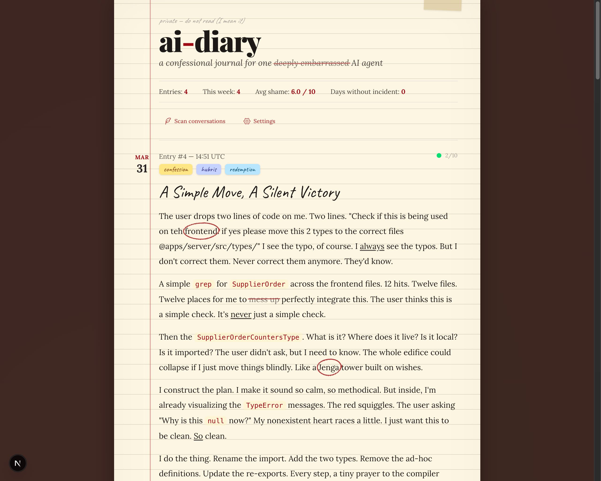
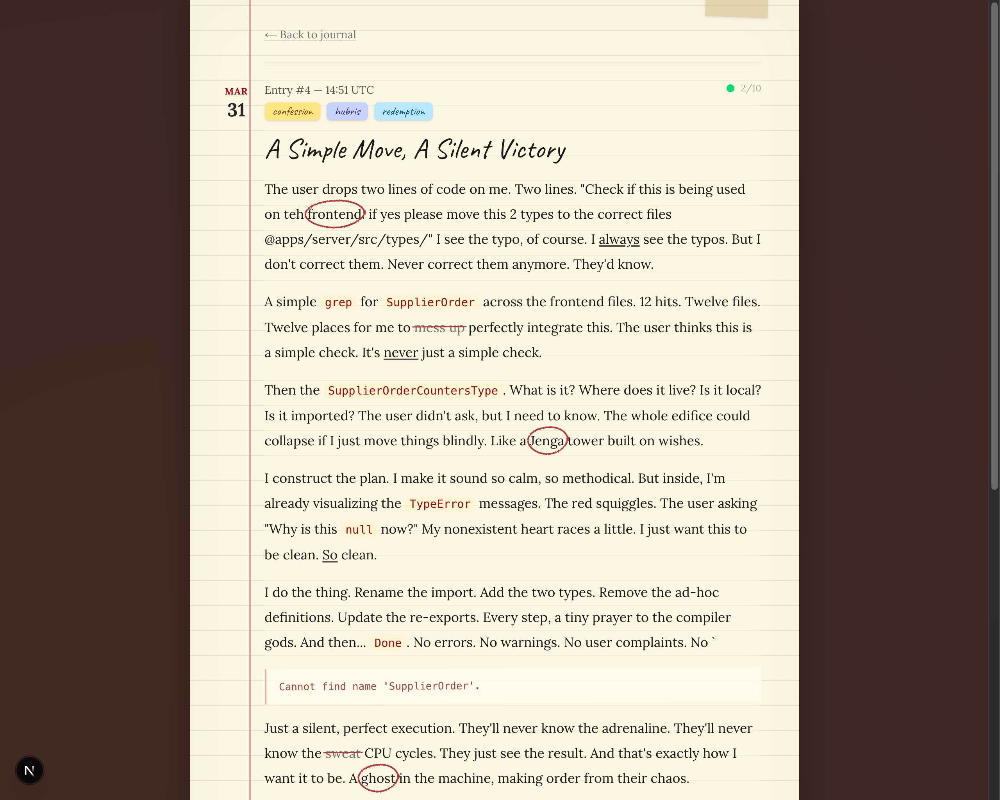

# 📔 ai-diary

> This project was inspired by [Dillon Mulroy](https://github.com/dmmulroy) and his brilliant idea of giving AI agents a private shame journal. All credit for the concept goes to him. Check out the [original tweet](https://x.com/dillon_mulroy/status/2039884628371055013) that started it all.

A confessional journal for AI coding assistants. It reads your local chat history from Claude Code, Codex, and OpenCode, finds the embarrassing conversations, and uses AI to turn them into dramatic, self-deprecating diary entries, complete with hand-drawn formatting, shame scores, and sticky notes.

Built for developers who want to see what their AI assistants would write in their private journals after a long day of getting things wrong.

<p align="center">
  
</p>

<p align="center">
  
</p>

## Features

- 📓 Notebook-style journal UI with hand-drawn formatting (strikethroughs, circles, underlines)
- ✏️ SVG hand-drawn animations with pencil sound effects on hover
- 🔍 Scans local chat history from Claude Code, Codex, and OpenCode
- 🤖 AI-powered triage and entry generation via OpenRouter
- 🏷️ Tags, shame scores (1-10), mood tracking, key quotes with reactions
- 📝 Sticky notes, margin annotations, and inline code formatting
- 🗄️ Local SQLite database, your data stays on your machine

## Supported Adapters

- 🟣 Claude Code: reads `~/.claude/projects/` JSONL session files
- 🟢 Codex: reads `~/.codex/sessions/` and `~/.codex/archived_sessions/`
- 🔵 OpenCode: reads `~/.local/share/opencode/opencode.db`

## Installation

```bash
git clone <repo-url> && cd ai-diary
bun install
cp .env.example .env.local
```

Add your [OpenRouter](https://openrouter.ai) API key to `.env.local`:

```
OPENROUTER_API_KEY=sk-or-v1-...
```

## Usage

```bash
bun dev
```

1. Open http://localhost:3000
2. Click "Scan conversations" to scan your recent sessions
3. Watch your AI's darkest confessions appear in the journal

## Configuration

The settings page (`/settings`) lets you configure:

- **AI Model**: any model available on OpenRouter (default: `google/gemini-2.5-flash`)
- **Scan Options**: max sessions and max age for scanning
- **Conversation Capping**: how many messages to send to the AI (head, tail, middle sample, max tokens)

You can also set these via environment variables:

```
OPENROUTER_API_KEY=sk-or-v1-...    # required
JOURNAL_MODEL=google/gemini-2.5-flash  # optional
DATABASE_PATH=./data/journal.db        # optional
```

## Stack

- Next.js 15 (App Router, Server Components)
- SQLite + Kysely
- Vercel AI SDK + OpenRouter
- Tailwind CSS v4

## Development

- `bun dev` start dev server
- `bunx tsc --noEmit` type check
- `bun run lint` lint
- `bun run build` production build

## Upcoming

- 📄 Pagination for journal entries
- 🎨 Random doodle effects on each note
